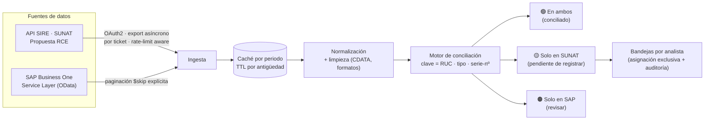

# SAP ↔ SUNAT Reconciler

> Pipeline de **integración y conciliación de datos** entre **SAP Business One** y la API
> **SIRE** de **SUNAT** (autoridad tributaria del Perú). Ingesta dos fuentes de verdad
> heterogéneas, las empareja a nivel de comprobante y expone las discrepancias como trabajo
> accionable — con ingesta consciente de *rate limits*, idempotente y cacheada.


---

## El problema de datos

El mismo comprobante de compra (una factura de proveedor) vive en **dos sistemas** que
deberían coincidir pero rara vez lo hacen al 100 %:

- **SUNAT** recibe el comprobante directo del proveedor (lo ve en el *Registro de Compras*, RCE).
- **SAP** lo tiene solo si Contabilidad ya lo registró.

Cada comprobante que está en SUNAT pero **no** en SAP es un registro pendiente — y, a fin de
mes, **riesgo tributario** (crédito fiscal no sustentado, observaciones). Conciliar esto a mano
son miles de comprobantes cruzados fila por fila. Este proyecto lo automatiza como un
**pipeline batch de reconciliación**.

## Flujo de datos



## Patrones de ingeniería de datos aplicados

El valor del proyecto no es "bajar dos listas y compararlas" — es hacerlo de forma **confiable
contra dos APIs de terceros hostiles** (con límites, formatos sucios y contratos no documentados):

| Patrón | Dónde | Por qué importa |
|---|---|---|
| **Ingesta multi-fuente** | `services/sunat.py`, `services/sap.py` | Une un export asíncrono (SUNAT) con un OData paginado (SAP) bajo una sola clave de negocio. |
| **Ingesta consciente de *rate limit*** | `sunat.py` (`_esperar_turno`, backoff) | SIRE devuelve **HTTP 429**; hay *throttle* global + reintentos con *backoff* exponencial acotado, medido desde la llamada real (no desde el inicio del ciclo). |
| **Idempotencia** | `sunat.py` (ticket sidecar) | El export de SUNAT es asíncrono por **ticket**; si la ventana de *polling* expira, se **reanuda el mismo ticket** en vez de disparar otro (evita un 422 real y duplicar trabajo). |
| **Caché incremental con TTL por antigüedad** | `sunat.py` (`ttl_horas`) | El mes en curso caduca en horas; los meses viejos, en días. Un **job nocturno** la precalienta para que nadie espere a SUNAT en horario laboral. |
| **Paginación robusta** | `sap.py` (`_todos`) | El Service Layer **no** devuelve `@odata.nextLink` de forma fiable → se pagina con `$skip` explícito (si te confías, te quedas con 100 de 4.819 registros). |
| **Data cleaning** | `sunat.py` (`limpiar`) · `conciliacion.py` (`clave`) | Nombres envueltos en **CDATA de XML**, series en distinto caso, ceros a la izquierda → se normalizan a una clave canónica. |
| **Aislamiento multi-tenant** | `empresas.py`, PK compuesta `(empresa, clave)` | Varias empresas comparten proveedores; los datos y las asignaciones **no se pisan** aunque coincida el número de comprobante. |
| **Reuso y *pooling* de sesiones** | `sap.py` (`SapSession`) | El Service Layer tiene sesiones **licenciadas limitadas**; una sesión larga reutilizada evita agotarlas bajo carga (bug encontrado con *load testing*, ver `pruebas_carga.py`). |
| **Trazabilidad** | tabla `auditoria` | Cada acción (login, asignar, liberar, revocar, cambio de estado) queda registrada con actor, empresa y momento. |

## Motor de conciliación

Empareja por **clave de negocio idéntica** en ambos lados:

```
RUC | tipo_comprobante | SERIE-NÚMERO
```

| Parte | En SAP | En SUNAT |
|---|---|---|
| RUC | `FederalTaxID` del proveedor (solo `Country = PE`) | Columna "Nro Doc Identidad" (tipo 6 = RUC) |
| Tipo | `PurchaseInvoices`=01 · `PurchaseCreditNotes`=07 | Columna "Tipo CP" |
| Serie-Nº | Campo `NumAtCard` | Columnas Serie + Número |

Se normaliza (serie en mayúsculas, número sin ceros a la izquierda) y se resuelve por
operaciones de conjuntos (`en_ambos = sap ∩ sunat`, etc.). Es el **mismo comprobante físico**:
cuando el número no coincide, es un **hallazgo real** (reemisión o error de digitación), no un
falso positivo del cruce.

## Stack

| Capa | Tecnología |
|---|---|
| **Ingesta / API** | FastAPI + Uvicorn (Python 3.10+), httpx |
| **Motor de conciliación** | Python puro (set operations, normalización) |
| **Estado / metadatos** | SQLite en modo **WAL** + SQLAlchemy 2 |
| **Frontend** | React 18 + TypeScript + Vite |
| **Identidad** | SAP Service Layer (SAP es la fuente de identidad — no se almacenan contraseñas) |
| **Orquestación batch** | Job de pre-carga vía Programador de tareas de Windows |
| **Despliegue** | Servicio de Windows (NSSM), un solo proceso sirve API + frontend |

## Arquitectura

```
conciliador/
├── deploy/                    # servicio Windows (NSSM) + tarea programada
├── backend/app/
│   ├── config.py              # configuración desde .env
│   ├── db.py                  # SQLite + WAL
│   ├── models.py              # sesiones, asignaciones, auditoría
│   ├── empresas.py            # registro multi-tenant
│   ├── auth.py                # identidad contra SAP + reglas de acceso
│   ├── routers/               # auth · cruce · bandeja
│   └── services/
│       ├── sap.py             # ingesta SAP (Service Layer, OData paginado)
│       ├── sunat.py           # ingesta SUNAT (SIRE / propuesta RCE, rate-limit aware)
│       └── conciliacion.py    # motor de emparejamiento
├── backend/refrescar_propuestas.py   # job batch de pre-carga (Task Scheduler)
├── backend/pruebas_carga.py          # load testing (latencia, concurrencia, sostenido)
└── frontend/src/              # Login · Cruce · Bandeja (React + TS)
```

## Roles y bandejas

- Se ingresa con el **usuario/clave de SAP** + la **empresa** elegida; la contraseña se valida
  contra el Service Layer y **nunca se almacena**.
- Acceso restringido al área de Contabilidad (`DEPARTAMENTOS_PERMITIDOS`, por defecto 4).

| Rol | Qué puede hacer |
|---|---|
| **analista** | Ve el cruce y **su propia bandeja**. Las asignaciones ajenas no le aparecen. |
| **manager** | Además: vista **Gestión** con todas las asignaciones, y puede **revocar** cualquiera. |

La asignación de un comprobante es **exclusiva** (lo garantiza la PK compuesta a nivel de base
de datos): dos analistas no pueden tomar la misma factura ni haciendo clic en el mismo instante.

---

## Cómo correrlo

### Desarrollo (dos terminales)

```bash
# 1) Backend  →  http://localhost:18450/docs
cd backend
uvicorn app.main:app --reload --port 18450

# 2) Frontend →  http://localhost:18451
cd frontend
npm install        # solo la primera vez
npm run dev
```
Vite hace *proxy* de `/api` al backend: para el navegador, API y frontend son el mismo origen
(sin líos de CORS ni cookies).

### Configuración

```bash
copy .env.example .env
python -c "import secrets; print(secrets.token_urlsafe(48))"   # para SECRET_KEY
```

Multi-empresa: se listan los códigos en `EMPRESAS=EMPRESA1,EMPRESA2` y cada una define su
bloque con prefijo (`EMPRESA1_SAP_COMPANY_DB=...`, `EMPRESA1_SUNAT_CLIENT_ID=...`, etc. — ver
`.env.example`). Una empresa a medio configurar **no tumba la app**: solo rechaza el login a
ella con un mensaje claro de qué falta. **El `.env` nunca se sube a Git.**

### Producción (Windows, sin Docker — nativo)

Un solo proceso sirve la API y el frontend compilado; corre como servicio y sobrevive reinicios.

```powershell
# entorno + build del frontend (el backend lo sirve si frontend/dist existe)
cd backend;  python -m venv .venv;  .venv\Scripts\pip install -r ..\requirements.txt
cd ..\frontend;  npm install;  npm run build

# servicio de Windows (requiere NSSM) + job nocturno de pre-carga
cd ..\deploy
.\instalar_servicio_backend.ps1 ;  Start-Service ConciliadorBackend
.\instalar_tarea_refrescar.ps1
```

Antes de exponerlo a otros PCs: `APP_ENV=production`, instalar el CA interno de SAP y poner
`SAP_VERIFY_SSL=true`, y **HTTPS** vía reverse proxy (las claves de SAP no deben viajar en claro).
Backup diario de `data/conciliador.db`.

## Contratos de API no documentados (aprendidos a la mala)

- SUNAT autentica con **`grant_type=password`**, no `client_credentials`.
- Descargar el ZIP de la propuesta exige además `numTicket`, `perTributario`, `codLibro` y
  `codProceso` — el manual no lo dice; sin ellos, **HTTP 500**.
- El Service Layer de SAP **no** devuelve `@odata.nextLink` de forma fiable → paginar con `$skip`.
- SIRE aplica **rate limit** (HTTP 429) en el endpoint de export → *throttle* + *backoff* + caché.

## Licencia

MIT — ver [LICENSE](LICENSE).
